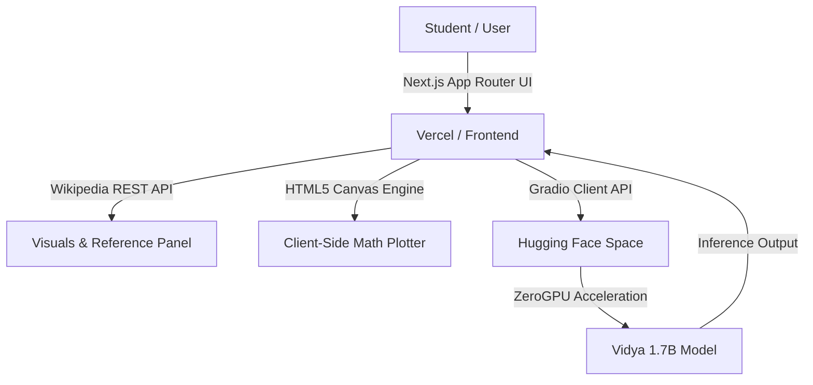

# 🎓 Vidya Educational LLM (`vidya-educational-llm`)

<p align="center">
  <strong>An Open-Source Multilingual NCERT-Focused Educational AI Companion for 11 Indian Languages</strong>
</p>

<p align="center">
  <a href="https://vidya-edu.vercel.app/"></a>
</p>

<p align="center">
  <a href="https://vidya-edu.vercel.app/"></a>
  <a href="https://huggingface.co/spaces/vedantjadhav701/vidya-1.7b"></a>
  <a href="https://huggingface.co/vedantjadhav701/edu-qwen-1.7b-merged"></a>
  <a href="local/VIDYA_BENCHMARK.md"></a>
  <a href="https://nextjs.org"></a>
  <a href="https://tailwindcss.com"></a>
  <a href="https://pytorch.org"></a>
  <a href="LICENSE"></a>
  <a href="#-contributing"></a>
</p>

<p align="center"><em>Developed by <strong>Vedant Jadhav</strong></em></p>

---

## 🌟 Overview

**Vidya Educational LLM** (`vidya-educational-llm`) is a state-of-the-art, open-source educational artificial intelligence ecosystem designed to democratize high-quality learning materials for students across India. 

Powered by a fine-tuned 1.7B parameter model (`vedantjadhav701/edu-qwen-1.7b-merged`), Vidya provides step-by-step explanations for **Science**, **Mathematics**, and **NCERT curricula** in **11 Indian languages**, featuring zero forced translation, interactive client-side mathematical graphing, and real-time visual reference fetching.

---

## ✨ Key Features

- 🇮🇳 **11 Supported Indian Languages**: Native fluency in **English, Hindi, Marathi, Tamil, Telugu, Bengali, Gujarati, Kannada, Malayalam, Punjabi, and Maithili**.
- 🎯 **Language Purity & Zero Fallback**: Answers strictly in the user's language without defaulting to Hindi.
- 📐 **Math & Science Precision**: LaTeX math rendering powered by KaTeX ($A = l \times w$) and step-by-step problem verification.
- 📊 **Interactive Canvas Graphing**: Safe client-side mathematical graph plotting (e.g., $y = x^2$, $\sin(x)$) without server-side compute overhead.
- 🖼️ **Visual Reference Panel**: Auto-fetches educational diagrams and images directly from Wikipedia API based on lesson context.
- ⚡ **ZeroGPU Cloud Backend**: Deployed on Hugging Face Spaces with dynamic GPU allocation.
- 🚫 **Clean Output (No CoT Leakage)**: Reasoning tokens (`<think>`) are filtered out for clear, concise student-facing answers.

---

## 🏆 Multilingual Educational Benchmark (v1.0)

Vidya 1.7B was benchmarked using the **Vidya Multilingual Educational Evaluation Suite (v1.0)** across **64 evaluation questions**, **8 Indian writing systems**, and **4 STEM domains** (Mathematics, Physics, Biology, Chemistry).

<p align="center">
  <a href="local/VIDYA_BENCHMARK.md">
    
  </a>
</p>

### 📊 Performance Summary

| Category | Dimension | Accuracy % | Score / 10 | Status |
| :--- | :--- | :---: | :---: | :---: |
| **Overall** | Aggregate (64 Items) | **93.3%** | `9.33 / 10` | 🟢 Outstanding |
| **Languages** | English | **97.5%** | `9.75 / 10` | 🟢 Exceptional |
| | Marathi | **95.0%** | `9.50 / 10` | 🟢 Exceptional |
| | Hindi, Maithili, Tamil, Urdu | **92.5%** | `9.25 / 10` | 🟢 High Accuracy |
| | Telugu, Bengali | **91.9%** | `9.19 / 10` | 🟢 High Accuracy |
| **STEM Domains** | Chemistry 🧪 | **99.4%** | `9.94 / 10` | 🟢 Near Perfect |
| | Physics ⚛️ | **95.6%** | `9.56 / 10` | 🟢 Exceptional |
| | Biology 🧬 | **95.6%** | `9.56 / 10` | 🟢 Exceptional |
| | Mathematics 📐 | **82.5%** | `8.25 / 10` | 🟡 Good Reasoning |

📖 **For full evaluation methodology, failure analysis, and sample outputs, read the full report:** [**`local/VIDYA_BENCHMARK.md`**](file:///C:/Users/HP/projects/Vidya-1.7B/local/VIDYA_BENCHMARK.md)

---

## 🏛️ System Architecture



---

## 📚 Supported Languages & Writing Systems

| Language | Script | Language | Script |
| :--- | :--- | :--- | :--- |
| **English** | Latin | **Hindi** | Devanagari |
| **Marathi** | Devanagari | **Maithili** | Devanagari |
| **Tamil** | Tamil | **Telugu** | Telugu |
| **Bengali** | Bengali | **Gujarati** | Gujarati |
| **Kannada** | Kannada | **Malayalam** | Malayalam |
| **Punjabi** | Gurmukhi | | |

---

## 📁 Repository Structure

```
vidya-educational-llm/
├── frontend-nextjs/           # Production Next.js 16 App Router UI
│   ├── app/                   # App Router pages & API routes (/api/image)
│   ├── components/            # React Chat & Visuals UI components
│   └── lib/                   # HF Gradio client, math parser & image helpers
├── backend-huggingface/       # Hugging Face ZeroGPU Space deployment files
│   ├── app.py                 # Gradio ChatInterface backend
│   └── src/                   # Model loader, system prompt & generation engine
├── webapp/                    # Legacy standalone reference webapp
├── folder-stucture.md         # Backend architecture specification
└── frontend_plan.md           # Next.js frontend migration specification
```

---

## 🚀 Quick Start Guide

### Prerequisites
- **Node.js**: v18.x or higher
- **npm**: v9.x or higher

### 1. Clone the Repository
```bash
git clone https://github.com/VedantJadhav701/vidya-educational-llm.git
cd vidya-educational-llm/frontend-nextjs
```

### 2. Install Dependencies
```bash
npm install
```

### 3. Configure Environment Variables
Create `.env.local`:
```env
NEXT_PUBLIC_HF_SPACE_ID=vedantjadhav701/vidya-1.7b
```

### 4. Run Development Server
```bash
npm run dev
```
Open [http://localhost:3000](http://localhost:3000) to interact with Vidya.

---

## 🧪 Production Build & Linting

```bash
# Run ESLint validation
npm run lint

# Compile optimized Next.js build
npm run build
```

---

## 🤝 Contributing

We welcome contributions from developers, educators, researchers, and open-source enthusiasts!

### How You Can Contribute:
1. 🐛 **Report Bugs**: Open an issue detailing step-by-step reproduction steps.
2. 💡 **Feature Requests**: Propose new educational tools, visual tools, or language enhancements.
3. 📝 **Improve Prompts**: Enhance system prompts in `backend-huggingface/src/prompts.py` for even higher pedagogical accuracy.
4. 🎨 **UI Component Enhancements**: Contribute to `frontend-nextjs/components/`.

### Contribution Steps:
```bash
# 1. Fork the Project
# 2. Create your Feature Branch
git checkout -b feature/AmazingEducationalFeature

# 3. Commit your Changes
git commit -m "Add AmazingEducationalFeature"

# 4. Push to Branch
git push origin feature/AmazingEducationalFeature

# 5. Open a Pull Request
```

Please make sure `npm run lint` and `npm run build` pass clean before submitting a PR.

---

## 📄 License

Distributed under the **MIT License**. See `LICENSE` for more information.

---

<p align="center">
  Made with ❤️ for Students and Educators across India 🇮🇳
</p>
